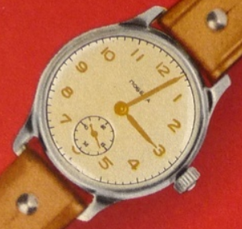

Title:   Pobeda Победа
Summary: liste des montres Pobeda Победа
Authors: lds
Date:    27 mai 2020

# Pobeda/Победа

## Catalogue de 1953

stainless steel case back, 15 rubies steel level movement. Monometal balance with special alloy hair spring. one complete winding last not less than 34 hour (for watch 34-K not less than 32h)

| modèle        | description           | image  |
| ------------- |-------------| -----:|
| 34-K       | Balancier à l'épreuve des chocs, dans un boîtier étanche à la poussière. Diamètre du boîtier 30,6 mm. Le fond du boîtier en acier inoxydable est sculpté. Chiffres des heures doré, cadran argenté  | |
| 52-K       | Diamètre du boîtier 26,9 mm. marqueurs et chiffres noirs. Aiguilles bleues. | |
| 103-K       | Diamètre du boitier 32mm, chiffres de l'échelle des heures dorés bordés de noir. aiguilles dorées.| |
| 103-K       | Diamètre du boitier 32mm, chiffres de l'échelle des heures dorés bordés de noir. aiguilles dorées.| |
| 26-K       | Case diameter 29,6. Silvered dial with black markers and numerals ('12' in red, blued hands)| |
| 112-K       | Case diameter 29,6. Raised figure dial, lacquered golden. Gilt hands.| |
| 114-K       | Case diameter 29,6. Silvered dial with print markers. Golden hour scale numerals, gilt hands.| |
| 119-K       | Case diameter 29,6. Dial dead silvered with 4 polished sectors. Black hour scale numerals. Blue hands.| |

